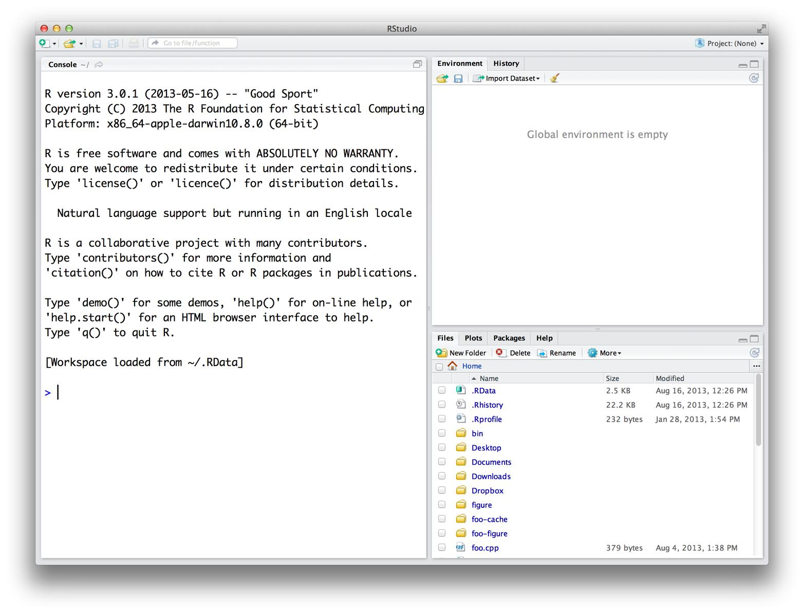
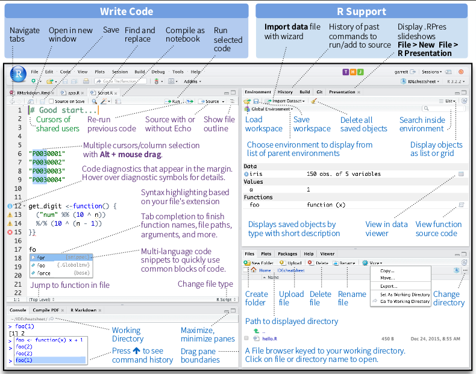

# Instalando R e RStudio e Shiny

Para iniciar com R você primeiro precisa adquirir uma cópia. R e RStudio são ambos gratuitos.

## Como baixar e instalar R

R é mantido por uma equipe internacional de desenvolvedores que fazem a linguagem disponível através da página web [**The Compehensive R Archive Network**](cran.r-project.org) (A rede compreensiva de arquivo R). No topo da página há três links que te direcionam às instalações em: Windows, Mac ou Linux.

### Binary ou Source
O R pode ser instalado de arquivos binários pré-compilados (*precompiled binaries*) ou construído da fonte (*built from source*) para qualquer sistema operativo. Para Windows e Mac, instalar dos arquivos binários é bem fácil. O binário vem carregado com seu próprio instalador. Apesar de você poder contruir da fonte nestas plataformas, o processo é bem mais complicado e não irá oferecer muitos benefícios à maioria dos usuários. Para Linux, o oposto é verdade. Arquivos binários pré-compilados podem ser encontrados para alguns sistemas, mas é muito mais comum construir R de arquivos fontes. As páginas de download em [**CRAN**](https://cran.r-project.org/) fornece informações sobre contruir da fonte para Windows, Mac e Linux.

### 32-bit ou 64-bit

R vem em duas versões 32-bit e 64-dit. Ambas as versões utilizam inteiros de 32-bits, ou seja, sua precisão numérica é a mesma. A diferença ocorre em como cada versão gerencia a memória. 64-bit R usa 64-bit ponteiros de memória, e 32-bit R usa 32-bit ponteiros de memória. Isto significa que o R de 64-bits tem um espaço maior para usar (e procurar). Como regra, 32-bit R é mais rápido, mas nem sempre. Em ambas as versões, os vetores são limitados a algo em torno de 2 bilhões de elementos. Se o seu sistema não suporta programs de 64-bits, ou sua memória principal (RAM) for menor que 4 GB, então instale a versão de 32-bits. O instalador do Windows e Mac irão automaticamente instalar a versão de 64-bits caso o seu sistema suporte.

### Windows

Para instalar R no Windows clica no link *"Download R for Windows"*, à partir siga as instruções no site e do instalador. O instalador que baixar do site irá instalar R em seu sistema. Você precisará ter privilégios de administração para instalar novos programas em sua máquina.

### Mac

Para instalar R em um Mac, clique no link *"Download R for Mac"*. Um instalador irá te guiar durante a instalação, ele deixa você personalizar a instalação, mas o padrão irá atender a maioria dos usuários.

### Linux

R vem pré-instalado em várias distribuições Linux, mas se quiser a versão de R mais atualizada precisará instala-la. O [**site CRAN**](https://cran.r-project.org/) disponibiliza os arquivos para contruir R da fonte em Debian, Redhat, SUSE, e Ubuntu no link *"Download R for Linux"*. O procedimento exato de instalação varia dependendo da distribuição Linux em uso. CRAN oference os arquivos fontes com arquivos README que explicam como instala-los.

## Usando R

R não é um programa, é uma linguagem de programação, como C, C++, Python ou UNIX. Você usa R escrevendo comandos na linguagem R e pedindo para seu computador interpreta-los. Há pessoas que preferem utilizar R na janela terminal UNIX - como nos filmes de hackers de 1980... Mas na atualidade temos as IDEs (Interfaces de Desenvolvimento), as quais auxiliam muito. A IDE padrão para o R é o RStudio.

### Como baixar e instalar RStudio

Você pode fazer download gratuíto aqui: [RStudio](https://www.rstudio.com/products/rstudio/).
Basta clicar em "Download RStudio" e seguir as instruções da instalação.

Quando abrir o RStudio, uma janela com três paineis nela irá aparecer, como na figura abaixo. 


O painel maior à esquerda é o *console* (janela de comandos), aqui é onde irá processar comandos de R e ver os resultados. Essa janela é exatamente se você estivesse rodando o R por um terminal, todas as outras janelas são únicas do RStudio. Nele você pode ter um editor de texto, uma janela gráfica, um *debugger* (depurador), um gerenciador de arquivos, etc. Utilizando-o você irá familiarizando-se com as posibilidades, não tenha medo de explorar.

Na figura abaixo você já tem um RStudio com diversas indicações do que faz cada coisa. Algumas indicações nesta janela podem não fazer sentido no momento, mas pode precisar/utiliza-las futuramente. Minha sugestão é que tome seu tempo para familiarizar-se com sua própria janela do RStudio, um bom conhecimento da ferramenta que utiliza irá economizar muito tempo em seus projetos.



## Instalando Shiny

A linguagem R já oferece uma gama extensa de funções para utilizarmos, estas funções iniciais chamamos de **base do R** (ou *"base R"* em inglês). Mas muitas vezes, normalmente para tarefas complexas, podemos economizar nosso tempo utilizando algum pacote que nos forneça funções já implementadas para usos específicos. Os pacotes do R funcionam de forma similar às bibliotecas do C, C++ e Javascript, pacotes de Python, e as gemas em Ruby.

Os pacotes do R juntam funções úteis, arquivos de ajuda, e bases de dados. Uma vez que você carregue o pacote para o seu programa poderá utilizar as funções implementadas neles. Neste treinamento focaremos em um pacote específico, o **shiny**, mas como todos os outros pacotes da linguagem R, iremos utilizar um comando do próprio R `install.packages()` para instala-lo. No console do RStudio, digite o comando abaixo:

```
install.packages("shiny")
```
Este comando irá procurar por um pacote específico na coleção de pacotes disponível no site CRAN. Qando o encontrar, irá realizar o download para a pasta de bibliotecas dp R em seu computador. Assim o R poderá acessar o pacote em futuras sessões, sem necessidade de reinstalar. Um ponto, importante de atenção, qualquer um pode escrever um pacote de R e compartilha-lo como quiser. Mas praticamente todos os pacotes são publicados através do CRAN, onde testam todos os pacotes antes de publica-los. Isto não elimina todos os *bugs* (erros) internos do pacote, mas te dá mais confiança para rodar um pacote.

Caso se interesse/precise, pode instalar vários pacotes de uma vez, com a função de **concatenação** do R, `c`. Por exemplo,

```
install.packages(c("ggplot2", "reshape2", "dplyr"))
```

Na sua primeira instação de pacotes, R irá perguntar de qual origem (*"mirror"*) deseja instalar. Os *mirrors* são classificados por localização, e o *download* supoem-se mais rápido de *mirrors* mais próximos. O *mirror* principal é o da Austria, nele são disponibilizados os pacotes novos e replicados para os outros em alguns dias.

## Outras referências

O tutorial abaixo é muito bom para instalação das últimas versões do R e RStudio em sistema Ubuntu:
* https://www.digitalocean.com/community/tutorials/how-to-set-up-r-on-ubuntu-14-04