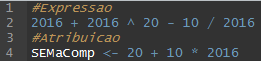
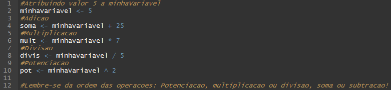
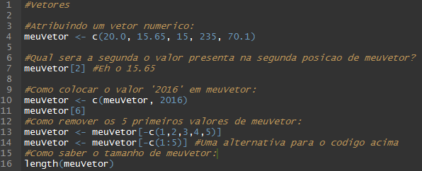
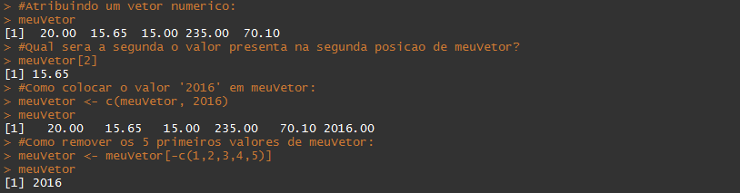

#Chega de conversa, mão na massa!

##Operações Básicas:
####Expressões e Atribuições
Os comandos do R são feitos de **Expressões** e **Atribuições**. **Expressão** é quando os valores são computados, executados no prompt e perdidos. Em **Atribuições** temos os valores computados e atribuidos a uma variável.

####Atribuindo valores e operações básicas
* **Atribuir valor:** Para atribuir um valor a uma variável: nomeie-a e utilize '<-' antes do valor.
* **Adição:** valor1 + valor2
* **Subtração:** valor1 - valor2
* **Multiplicação:** valor1 * valor2
* **Divisão:** valor1 / valor2
* **Potenciação:** valor1 ^ valor2

*Lembre-se da ordem de prioridade das operações: 1º Potenciação, 2º Multiplicação ou Divisão, 3º Adição ou Subtração.*

####Operações Lógicas
* **> ou >= :** *Maior* ou *Maior ou Igual*
* **< ou <= :** *Menor* ou *Menor ou Igual*
* **== ou != :** *Igual* e *Diferente*
* **& ou | ou ! :** *And* ou *Or* ou *Not*
* **T ou F :** *True* ou *False

####Vetores

O R opera em [estrutura de dados](https://pt.wikipedia.org/wiki/Estrutura_de_dados). Um **vetor numérico** é a mais simples delas, uma **"coleção ordenada de números"**. Vejamos como funciona a atribuição de um vetor e operações com o mesmo.
* Para "criar" um vetor utilize: nome_Vetor <- c(v1, v2, v3...) 

*Utiliza-se a função c() que coloca seus argumentos em uma coleção, ou seja, concantena-os.*
* **nome_do_vetor[indice]:** Retorna o valor da posição 'indice' do vetor.
* **nome_do_vetor <- c(nome_do_vetor, novo_valor):** Forma de adicionar um novo valor ao vetor.
* **nome_do_vetor <- nome_do_vetor[-c(indice)]:** Forma de retirar o valor da posição 'indice' do vetor.
* **length(nome_do_vetor):** Retorna a quantidade de valores que seu vetor possui.

######Console:

