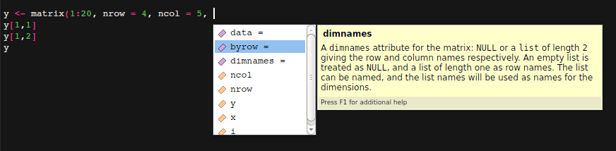

# Operações com matrizes e arrays, e dataframes e lists

## Matrizes e arrays

Para criar uma matriz podemos usar tanto o comando `array` como o comando `matrix` que possui poucas diferenças entre sí. Teste o código abaixo:

```r
x <- array(1:20, dim=c(4,5))
y <- matrix(1:20, nrow = 4, ncol = 5)
x == y
is.array(x)
is.array(y)
is.matrix(x)
is.matrix(y)
```

Ué! Teste as respostas por você... todas devem dar respostas `TRUE`. Ué(2)!! Então por quê temos essas duas possibilidades???

*Pequeno Desafio:* **1) Você sabe encontrar e dizer o por quê? Se souber, por favor, guarde para você anote, e veremos durante o curso. ;)**

Pensou já no desafio acima? Vamos continuar, em como podemos acessar e manusear os dados de uma matriz. Utilizaremos agora a função `matrix`, só por escolher mesmo e aplicaremos algumas funções nas matrizes que criarmos.

Como acessar os dados da matriz? Não muda muito em como acessávamos os vetores, só agora precisamos adicionar mais uma dimensão ao chamar o(s) elemento(s):

```r
y <- matrix(1:20, nrow = 4, ncol = 5)
y[1,1]
> 1 # resposta esperada
y[1,2]
> 5 # resposta esperada
```

Vemos que para chamar um elemento da matriz, separamos os índices das dimensões (linhas e colunas) por uma `,` (vírgula). E no chamado `y[1,1]` devemos obter o elemento do canto superior esquerdo da matriz. E o 2º elemento da 1ª linha, que obtivemos com a chamada, `y[1,2]` foi o número 5... ou seja a nossa matriz está preenchida por coluna, assim:

```r
y
> #      [,1] [,2] [,3] [,4] [,5]
> # [1,]    1    5    9   13   17
> # [2,]    2    6   10   14   18
> # [3,]    3    7   11   15   19
> # [4,]    4    8   12   16   20
```

**2) como podemos criar a mesma matriz, só que preenchida por linhas?**

*dica*: utilize a ajuda do RStudio de autocompletar com o botão `Tab`, para isso, digite o seguinte `y <- matrix(1:20, nrow = 4, ncol = 5,` sem o parêntesis no final, terminando em vírgula, e com o cursos após a vírgula aperte `Tab`, você deve ver algo assim:



O que você está vendo é uma lista dos possíveis argumentos da função `matrix`. Um desses argumentos é capaz de resolver o exercício 2).

Um sugestão, à parti de agora, teste usar o botão `Tab` ao escrever novos códigos. Você pode encontra muita ajuda e informações úteis com isso. :D

Agora, quem já ouviu falar do R, deve ter ouvido falar que é uma linguagem altamente especializada para Matemática, Estatística, correto? Ou, ao menos, deveria. rs

Primeiro vamos criar duas novas matrizes:

```r
x <- matrix(c(2,4,3,1,5,7), # os elementos de dados
            nrow=2,         # número de linhas
            ncol=3          # número de colunas
            )
y <- matrix(c(1,2,3,4,5,6),
            nrow=2,
            ncol=3
            )
```
Bom, agora que sabemos de matrizes podemos testar algumas coisas mais matemáticas. Por exemplo, explore a diferença entre as duas linhas de comando abaixo:

```r
x * y
t(x) %*% y
```

**3) qual é a diferença entre as duas linhas acima? Mostre o cálculo que foi feito,**

**4) o que faz a função `t` na segunda linha?**

E funções estatísticas? afinal o R é uma linguagem de programação estatística! E é seu ponto forte! Bom, algo para iniciar seriam os comando abaixo, ainda com nossa matriz `x` criada acima:

```r
mean(x)
sd(x)
var(x)
summary(x)
```

**5) Veja quais são os resultados e identifique que tipo de cálculo estatístico as funções `mean`, `sd` e `var` realizam? E a função `summary`?**

Bom, por enquanto, temos uma boa base das possibilidades de vetores e matrizes, parabéns! Respire fundo, de um sorriso para seu amigo(a) de curso ao lado e, se ele estiver 'travado' antes desta etapa, tente ajuda-lo. Rever um pouco dos conceitos irá ajudar e tentar explicar para alguém irá ajudar, caso sinta muita dificuldade peça para um monitor ajudar.

Após este exercício diferente, siga em frente para dataframes. :D

## Lists

Uma lista no R é um objeto consistindo de uma coleção ordenada de objetos, conhecidos como seus *componentes*.

Não há necessidade dos componentes serem do mesmo tipo, e, por exemplo, uma lista pode consister de um vetor numérico, um valor lógico booleano, uma matriz, um vetor complexo, um vetor de chars, uma **função**, e assim vai. Aqui está um simples exemplo de como criar uma lista:

```r
Lst <- list(name="Fred", wife="Mary", no.children=3,
              child.ages=c(4,7,9))
```

Componentes são sempre *numerados* e podem ser sempre referenciados como tal. Desta forma `Lst` é o nome de uma lista com quatro componentes, estes podem ser individualmente referenciados como `Lst[[1]]`, `Lst[[2]]`, `Lst[[3]]` e `Lst[[4]]. E como  o elemento `Lst[[4]]` é im vetor então ```Lst[[4]][1]``` será o primeiro elemento deste vetor. Tome seu tempo para entender este ponto.

`Lst` é uma lista, então a função `length(Lst)` irá nos dar o número de componentes de nível mais alto que ela possui.

Componentes de uma lista podem também ser **nomeados**, e neste caso o componente pode também ser referenciado pelo seu nome, no lugar dos duplos colchetes. O que fica mais conveniente.

**1) Por exemplo, o que ocorre ao chamar o comando abaixo?**

```r
Lst$name
Lst$wife
```

**2) E, melhor ainda, o que ocorre ao apertar o `Tab` após escrever `Lst$`?**

E a dúvida que não quer calar, por quê usamos colchetes duplas se quando usávamos vetores e matrizes só era necessário colchete simples???

Bom, há algumas razões para isso, mas uma das principais é que a listas podem ser extendidas ao especificar componentes adicionais. Por exemplo:

```r
Lst[5] <- list(matrix=Mat)
```

### Dataframes