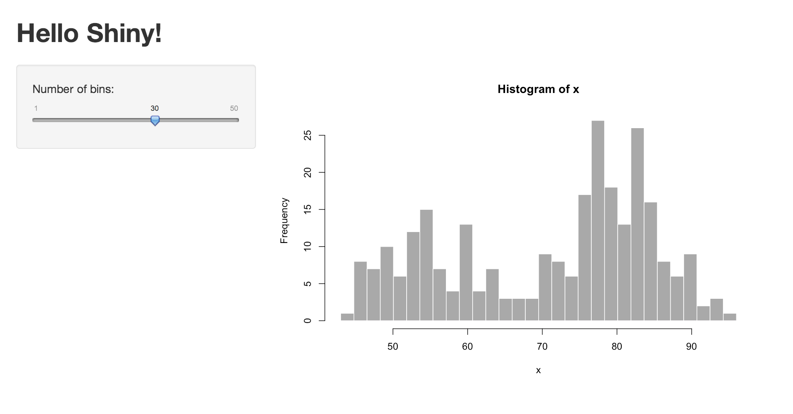

# Shiny, como começo?

O pacote shiny disponibiliza onze exemplos de aplicativos já construídos que demonstram como o Shiny funciona. Cada exemplo é um aplicativo completo e independente.


O exemplo **Hello Shiny** traça o histograma da base `faithful` do R, com um número configurável de divisórias (*bins*) para o gráfico. O usuário pode mudar o número de divisórias com uma barra de deslizamento, e o app responde em tempo real. Vamos utilizar o **Hello Shiny** para explorar a estrutura de um aplicativo Shiny e criar nosso primeiro app.

Para rodar **Hello Shiny**, digite:

```r
library(shiny)
runExample("01_hello")
```

## Estrutura de um aplicativo Shiny

Aplicativos Shiny possuem dois componentes:
* um *script* para interface do usuário
* um *script* de servidor

O código da interface de usuário (**ui**) controla o aspecto visual (*layout*) de seu aplicativo. Ele é definido em um código fonte com nome `ui.R`. Aqui está o código `ui.R` do exemplo **Hello Shiny**.

#### ui.R
```r
library(shiny)

# Define um UI para aplicação que desenha um histograma
shinyUI(fluidPage(

  # Título do aplicativo
  titlePanel("Hello Shiny!"),

  # Barra lateral com uma entrada de barra deslizante (slider) para o número de divisórias
  sidebarLayout(
    sidebarPanel(
      sliderInput("divisorias",
                  "Número de divisórias:",
                  min = 1,
                  max = 50,
                  value = 30)
    ),

    # Show a plot of the generated distribution
    mainPanel(
      plotOutput("distPlot")
    )
  )
))
```

Já o código `server.R` contém as instruções que o computador precisa para construir o seu app. Aqui está o código `server.R` para **Hello Shiny**:

#### server.R

```r
library(shiny)

# Define a lógica do server necessária para desenhar o histograma
shinyServer(function(input, output) {

  # Expressão que gera o histograma. A expressão é
  # envolta em uma chamada de renderPlot para indicar que:  
  #
  #  1) Ela é "reativa" portanto deve ser re-executada automaticamente
  #     quando uma entrada (input) muda
  #  2) Sua saída (output) é um gráfico
  
  output$distPlot <- renderPlot({
    x    <- faithful[, 2]  # Old Faithful Geyser data
    bins <- seq(min(x), max(x), length.out = input$divisorias + 1)

    # draw the histogram with the specified number of bins
    hist(x, breaks = bins, col = 'darkgray', border = 'white')
  })
})
```

O código `server.R` de **Hello Shiny** basicamente, realiza uns cálculos e traça um histograma com o número de divisórias requerido. Perceba que a maior parte do código está envolto em uma função `renderPlot`. O comentário acima da função explica um pouco sobre ela, se você acha confuso, não se preocupe. Nos veremos este conceito em mais detalhe.

Brinque um pouco com o aplicativo **Hello Shiny** e analise o código. Tente ligar o código com o visual e funcionalidades do aplicativo.

Enquanto seu aplicativo **Hello Shiny** estiver ativo, sua sessão de R permanecerá ocupada. Logo você não conseguira compilar nenhum comando de R. Isso se deve ao fato do R estar monitorando seu aplicativo e executando as reações requeridas no aplicativo. Para recuperar sua sessão, o que fechará seu app, pressione `Esc` (escape) ou clique no ícone de stop (encontrado no canto superior direito do seu painel de console no RStudio).

## Compilando um App

Todos os aplicativos Shiny possuem a mesma estrutura: dois códigos R salvos juntos em um diretório (pasta). No mínimo o aplicativo terá um arquivo `ui.R` e um `server.R`.

Em versões mais recentes é possível criar aplicativos Shiny em um único arquivo, porém nos concentraremos neste tutorial em aplicativos com a estrutura de dois arquivos. Desta forma, para cada aplicativo você irá precisar criar uma pasta exclusiva para esse aplicativo e salvar dois arquivos R (`ui.R` e `server.R`) dentro dela.

Você pode compilar um aplicativo Shiny fornecendo o nome da pasta para a função `runApp`. Por exemplo, se tivessemos uma pasta chamada `meu_app`, posso compilar o aplicativo dentro dela com o código abaixo:

```r
library(shiny)
runApp("meu_app")
```

No caso de você estiver devaneando, o aplicativo **Hello Shiny** é salvo em um diretório especial chamado `"01_hello"`. Este diretório é especial pois funciona com a chamada da função `runExample ("01_hello")`.

## Outros exemplos

Você pode criar aplicativos Shiny copiando e modificando aplicativos existentes. A [galeria](http://shiny.rstudio.com/gallery/) Shiny fornece bons exemplos, ou você pode explorar os onze exemplos disponíveis no pacote Shiny listados abaixo.

```r
system.file("examples", package="shiny")

runExample("01_hello") # um histograma
runExample("02_text") # tabelas e data frames
runExample("03_reactivity") # uma expressão reativa
runExample("04_mpg") # variáveis globais
runExample("05_sliders") # barras deslizantes
runExample("06_tabsets") # painéis tabulados
runExample("07_widgets") # texto de ajuda e botões de submissão
runExample("08_html") # Aplicativo Shiny contruído do HTML
runExample("09_upload") # mago para upload de arquivos
runExample("10_download") # magoo para download de arquivo
runExample("11_timer") # um cronômetro automatizado
```

Cada exemplo abaixo representa uma possibilidade interessante para desenvolvimento de aplicativos. Não se preocupe caso não entenda extamente cada código, aprofundaremos alguns deles mais adiante, mas sinta-se à vontade de perguntar aos monitores.

**1) Abra alguns dos exemplos e identifique algumas funções de *input* (semelhantes à função `sliderInput` vista em _Hello Shiny_). O que essa funções encontradas constroem? **
*Faremos esta juntos durante o curso. :)*