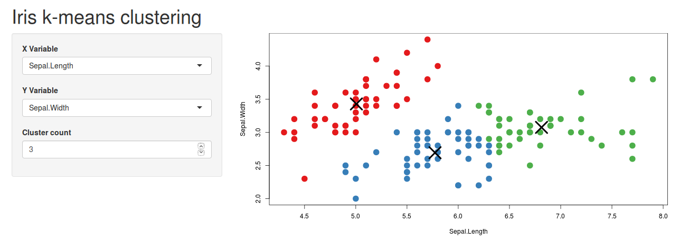

# Aprofundando

À partir de todo o conhecimento adquirido, podemos começar a complicar. Eu gostaria de fazer um aplicativo para análise dos dados `iris` (base de dados clássica de aprendizado de máquina). Iremos aplicar um algoritmo chamado `kmeans`.

O conceito do `kmeans` é, basicamente, um algoritmo de agrupamento que detecta centróides de conjuntos comuns à partir de uma medida de distância determinada. Não é tão importante entender seu funcionamento interno, mas caso queira entender um pouco mais leia a [wiki kmeans](https://pt.wikipedia.org/wiki/K-means).

O que precisamos saber é que temos a função `kmeans` já disponibilizada no R, basta chamarmos ela. Se escrevermos `kmeans` no RStudio e abrirmos parênteses, obteremos um descritivo dos argumentos que a função recebe.


Lembrando, é possivel obter a ajuda detalhada sobre a função utilizando ```r  help(kmeans) ```.

Porém, em nosso aplicativo minimalista, não vamos utilizar todos os argumentos da função. Iremos utilizar somente **x** e **centers**. Onde **x** são os dados que no nosso caso serão os dados **iris** e **centers** que é a quantidade de conjuntos que queremos dividir nossos dados ou um conjunto inicial de clusters. Caso tenha alguma dúvida aqui, pergunte ao monitor, mas reforçando, não é necessário entendermos as entranhas do algoritmo `kmeans`, o que queremos é criar um aplicativo que sirva de interface para o `kmeans`.

## Exercício 1.

Utilize o template abaixo e organize os blocos de código **a)**, **b)**, **c)**, **d)** e **e)** nas linhas abaixo dos comentários no template.

  ```r
  # template
  palette(c("#E41A1C", "#377EB8", "#4DAF4A", "#984EA3",
  "#FF7F00", "#FFFF33", "#A65628", "#F781BF", "#999999"))

  library(shiny)

  ui <- fluidPage(
    headerPanel('Iris k-means clustering'),
    # um bloco virá aqui abaixo
    
    # outro bloco virá aqui abaixo

  )

  server <- function(input, output) {
    # um bloco virá aqui abaixo
    
    # outro bloco virá aqui abaixo
    
    # e outro bloco virá aqui abaixo

  }

  shinyApp(ui = ui, server = server)
  ```
  
  E as funções abaixo:
  
  ### a)
  ```r
    output$plot1 <- renderPlot({
      par(mar = c(5.1, 4.1, 0, 1))
      plot(selectedData(),
           col = clusters()$cluster,
           pch = 20, cex = 3)
      points(clusters()$centers, pch = 4, cex = 4, lwd = 4)
    })
  ```
  
  ### b)
  ```r
    mainPanel(
      plotOutput('plot1')
    )
  ```

  ### c)
  ```r
    selectedData <- reactive({
      iris[, c(input$xcol, input$ycol)]
    })
  ```
  
  ### d)
  ```r
    sidebarPanel(
      selectInput('xcol', 'X Variable', names(iris)),
      selectInput('ycol', 'Y Variable', names(iris),
        selected = names(iris)[[2]]),
      numericInput('clusters', 'Cluster count', 3,
        min = 1, max = 9)
    ),
  ```
  
  ### e)
  ```r
    clusters <- reactive({
      kmeans(selectedData(), input$clusters)
    })
  ```
  
A resposta esperada é o seguinte app:

