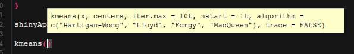

# Aprofundando

À partir disto, incluiremos os artefatos de nossa análise dos dados `iris`, onde iremos aplicar um algoritmo chamado `kmeans`. O conceito do `kmeans` é, basicamente, um algoritmo de agrupamento que detecta centróides de conjuntos comuns à partir de uma medida de distância determinada. Caso queira entender um pouco mais leia a [wiki kmeans](https://pt.wikipedia.org/wiki/K-means), porém não é tão importante entender seu funcionamento interno. O que precisamos sabe é que temos a função `kmeans` já disponibilizada no R, basta chamarmos ela. Se escrevermos `kmeans` no RStudio e abrirmos parênteses, obteremos um descritivo dos argumentos que a função recebe.



Lembrando, é possivel obtermos uma ajuda detalhada sobre a função utilizando
  ```r
  help(kmeans)
  ```
Porém, em nosso aplicativo minimalista, não vamos utilizar todos os argumentos da função. Iremos utilizar somente **x** e **centers**. Onde **x** são os dados que no nosso caso serão os dados **iris** e **centers** que é a quantidade de conjuntos que queremos dividir nossos dados ou um conjunto inicial de clusters. Caso tenha alguma dúvida aqui, pergunte ao monitor, mas reforçando, não é necessário entendermos as entranhas do algoritmo `kmeans`, o que queremos é criar um aplicativo que sirva de interface para o `kmeans`.
