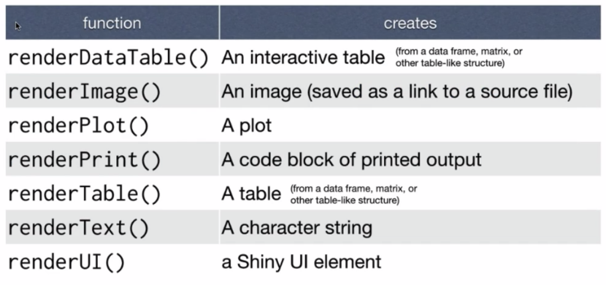

# Diga ao `server` como agregar inputs nos outputs

Abaixo é como a função `server` deve ficar em seu template ao início do programa:

  ```r
  server <- function(input, output) {


  }
  ```

Para explicar como o `server` deve unir os **inputs** com os **outputs** devemos popular a função `server` com instruções. Estas instruções devem seguir 3 regras:
## 1. Salve objetos para exibir a saída (**output$**)
  ```r
  server <- function(input, output) {
    output$hist <- # código

  }
  ```
  Se você está construindo uma saída, você deve salvar o objeto em **output$**. No código acima, o código irá salvar o objeto no elemento `hist` da lista de saídas... sím! o argumento **output** é uma `list`, lembra dela? rsrs (observação: o argumento **input** do seu `server` tambem é uma `list`).
  
  Eu escolhi o nome `hist`, porque é o mesmo nome colocado na nossa função do `ui`, a `plotOutput("hist")`, lembra?
  
## 2. A segunda regra é, o que você salvar no **output** é algo criado com uma função **render*()** (renderizada).
  ```r
  server <- function(input, output) {
    output$hist <- renderPlot({
    
    })
  }
  ```
Então, o Shiny provê um terceiro tipo de função, funções de renderização (**render functions**). As funções de renderização (**render**) trabalham junto com as funções de saídas (**output**) para criar o tipo de saída que você deseja fazer.



Perceba também que o argumento passado para a função **render*()** é diferente, por exemplo, no código abaixo:

  ```r
  renderPlot({ hist(rnorm(100)) })
  ```


