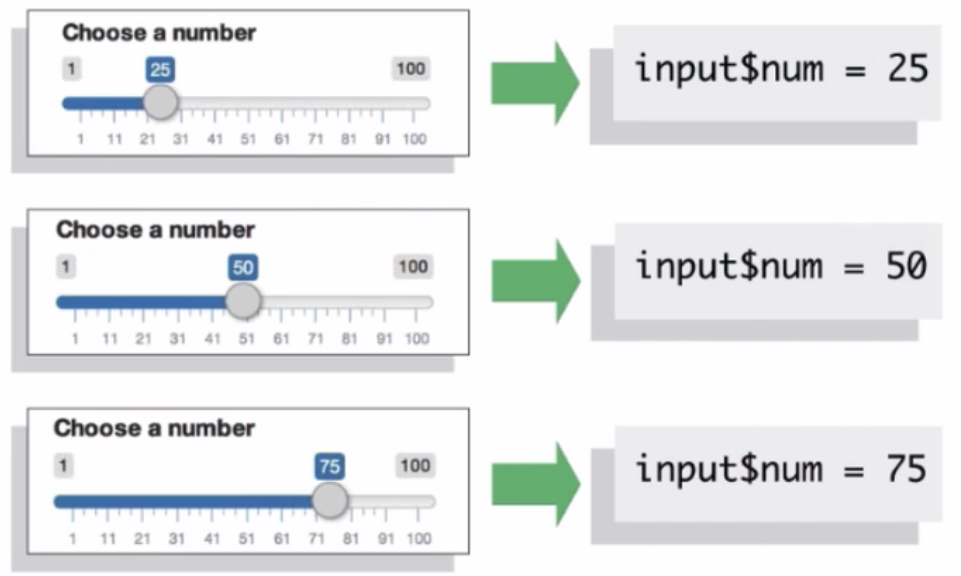

# Diga ao `server` como agregar inputs nos outputs

Abaixo é como a função `server` deve ficar em seu template ao início do programa:

  ```r
  server <- function(input, output) {


  }
  ```

Para explicar como o `server` deve unir os **inputs** com os **outputs** devemos popular a função `server` com instruções. Estas instruções devem seguir 3 regras:
### 1. Salve objetos com `output$` para exibir a saída 
  ```r
  server <- function(input, output) {
    output$hist <- # código

  }
  ```
  Se você está construindo uma saída, você deve salvar o objeto em **output$**. No código acima, o código irá salvar o objeto no elemento `hist` da lista de saídas... sím! o argumento **output** é uma `list`, lembra dela? rsrs (observação: o argumento **input** do seu `server` tambem é uma `list`).
  
  Eu escolhi o nome `hist`, porque é o mesmo nome colocado na nossa função do `ui`, a `plotOutput("hist")`, lembra?
  
### 2. A segunda regra é, o que você salvar no output é algo criado com uma função `render*()` (renderizada).
  ```r
  server <- function(input, output) {
    output$hist <- renderPlot({
    
    })
  }
  ```
Então, o Shiny provê um terceiro tipo de função, funções de renderização (**render functions**). As funções de renderização (**render**) trabalham junto com as funções de saídas (**output**) para criar o tipo de saída que você deseja fazer.


Perceba também que o argumento passado para a função **render*()** é diferente, por exemplo, no código abaixo:

  ```r
  renderPlot({ hist(rnorm(100)) })
  ```

Todas as funções começam com `render` e continua com o nome do objeto que queremos criar, no caso `Plot`. O argumento que a função de renderização recebe é um bloco de código em R que constrói o objeto que você quer fazer. O código acima irá contruir um histograma (função `hist` do R base) de de 100 números aleatórios de uma distribuição normal (função `rnorm` do R base).

Colocamos chaves em torno do código para passa-lo como um bloco unificado de código R. O que as chaves nos deixam fazer é colocar quantas linhas de R precisarmos para gerar o objeto desejado. Ou seja, se nosso objeto exige 100 linhas de código... colocamos as 100 linhas de código entre as chaves, e pronto. Mas não se preocupe, não vamos precisar de 100 linhas de código. :P Mas aqui é onde você pode começar a construir apps bem complexos.

Mas só temos 2 regras até o momento, a nossa terceira regra é,

### 3. Use valores de entrada com `input$`

Lembra do nosso input abaixo?

  ```r
  sliderInput(inputId = "num", ...)
  ```
pode chamar seus **inputs** com sintáxe similar ao que utiliza para os **outputs** - `input$num`. E os valores de **input** que me refiro são todos os valores das funções de entrada que tenha colocado no `ui`, e por isso é importante um id único. ;)

Ou seja, chamando `input$num` teremos sempre o valor atualizado, sempre que o usuário trocar a entrada.



Alterando então nossa função `server` para

  ```r
  server <- function(input, output) {
    output$hist <- renderPlot({
      renderPlot({ hist(rnorm(100)) })
    })
  }
  ```