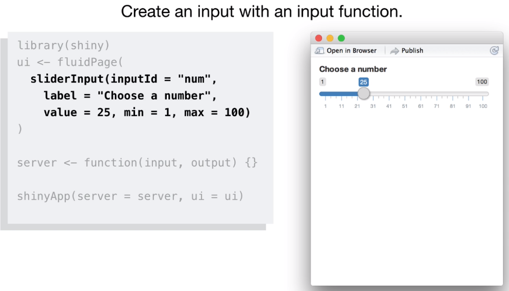
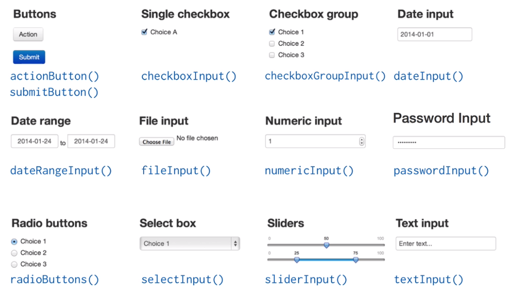
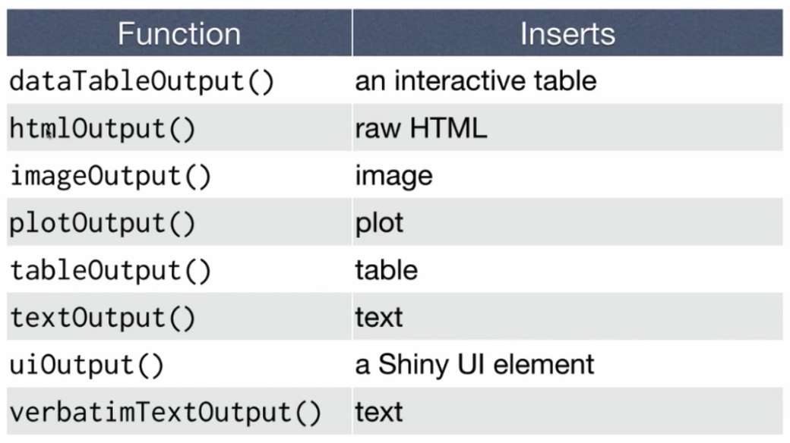
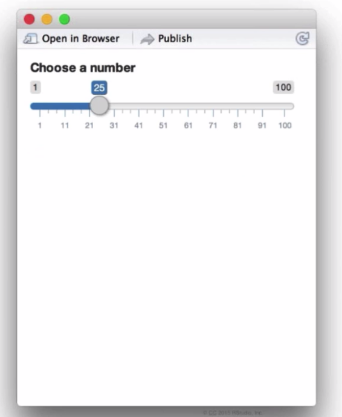

# Mãos na massa!

Vamos iniciar montando um aplicativo de visualização dos dados `iris`, que vimos anteriormente. 

Bom, como começar? Lembre que falamos sobre dois arquivos `ui.R` e `server.R`? Para este projeto, como nosso código final não será muito grande, iremos criar um único arquivo. Pode então, criar um novo `R script` em seu RStudio (em `File -> New File -> R script`), e dê o nome de `app.R`.

Tendo o arquivo criado, vamos iniciar com a estrutura base para qualquer aplicativo Shiny. Este é o nosso **template**!!

  ```r
  library(shiny)

  ui <- fluidPage()

  server <- function(input, output) {}

  shinyApp(ui = ui, server = server)
  ```

Veja que, como incluímos nosso *script* em um único arquivo temos uma nova função `shinyApp(ui = ui, server = server)`. A chamada dessa função recebe dois argumentos, que são os objetos criados `ui` e `server`. Essa função que possibilita o aplicativo em um único arquivo.

Antes da função `shinyApp`, temos a criação dos dois objetos: `ui` que recebe a função `fluidPage` e `server` que é uma função, definida com `function(input, output)`.

Leia abaixo com calma e pergunte ao monitor se precisar.

## Inputs e Outputs

Os **inputs** são coisas que o usuário pode variar, ou pode prover valores para o seu app. E **outputs** são objetos R que o usuário pode ver, plots, tabelas, textos...

os Inputs e outputs devem entrar como argumentos da sua função `fluidPage`. Algo assim:

  ```r
  ui <- fluidPage(
    # *Input() functions,
    # *Output() functions
  )
  ```

### Inputs

  ```r
  sliderInput(inputId = "num",
      label = "Escolha um número",
      value = 25, min = 1, max = 100)
  ```

O código acima, por exemplo, é uma função de **input** que irá criar um objeto deslizante em Shiny.

Se você colocar a função acima no seu **template** iremos obter algo como abaixo, teste isto:



Deve ter criado um objeto deslizante, no seu RStudio. Aqui é uma imagem... então não consigo fazer deslizar para você, é importante que teste! :P

O Shiny provê uma duzia de funções de **input**, conforme abaixo:




Todas são disponíveis na biblioteca Shiny e pode utilizar em seu app.

Todas as funções de input recebem os mesmos dois primeiros argumentos,

  ```r
  sliderInput(inputId = "num", label = "Choose a number", ...)
  ```
estes são o `inputId`, que é o nome do **input** que deve ser único para identificação e é para uso interno de seu app, e o segundo argumento é  `label` que é somente um rótulo que o usuário irá ver, é uma forma de dizer ao usuário o que fazer com aquele objeto. Caso você não queira adicionar um `label` somente iguale-o à duas aspas `label = ""` e não aparecerá nada, mas lembre-se de cuidar da "Interação Humano Computador".

Daí temos os `...`, que cada função de **input** aceita diferentes argumentos que definirão como o objeto irá fazer seu trabalho. Por exemplo, o `sliderInput` precisa saber qual é o mínimo valor e máximo valor possível que o usuário pode escolher e um valor inicial.

Lembre-se, para obter informações mais específicas sobre uma função no R basta usar `?sliderInput` ou `help(sliderInput)`. Teste com algumas das funções **inputs** da imagem e veja se os argumentos fazem sentido.

### Outputs

Lembrando, **Outputs** são tipos como plots, tabelas, textos... coisas que você consegue criar com R.


Estas são as funções que colocam no seu app diferentes tipos de saídas, então há uma função dedicada à colocar gráficos no seu app, uma função para colocar tabelas, textos, e assim vai.

Para exibir uma saída, adicione-a ao seu `fluidPage()` com uma função de **output**, por exemplo:

```r
plotOutput(outputId = "hist")
```
Cada função de **output** requer um argumento chamado `outputId`, que igual às funções de **input** é um nome para a sua saída e pode colocar o nome que quiser.

Então, para adicionarmos nossa função de output para nosso app, o passaremos para a nossa função `fluidPage` conforme à seguir:

  ```r
  library(shiny)

  ui <- fluidPage(
    sliderInput(inputId = "num",
      label = "Escolha um número",
      value = 25, min = 1, max = 100),
    plotOutput("hist")
  )

  server <- function(input, output) {}

  shinyApp(ui = ui, server = server)
  ```
  
  Não esqueça de adicionar uma vírgula entre os argumentos passados para `fluidPage()`. E se processarmos nosso app agora, veremos o seguinte:
  
  
  Ué! Mas não mudou nada... o que aconteceu?
  
  A função **Output()** adiciona somente um espaço na interface para que seja adicionado um objeto R. Mas pelo código que escrevemos, o app não tem ideia de que objeto colocar ali... apesar de termos colocado como nome do plot de `"hist"`, o app não sabe quem é esse tal de `hist`, então tudo que ele pode fazer foi reservar um espaço para ele.
  
  Agora precisamos dizer ao app como constuir aquele *plot*, e isso é algo que fazemos com a função do `server`. Mas antes de olhar a função `server` vamos rever tudo que temos até o momento.
  
  ## Recapitulando
  
  1. Recomento que sempre comece o app com o **template**:

  ```r
  library(shiny)

  ui <- fluidPage()

  server <- function(input, output) {}

  shinyApp(ui = ui, server = server)
  ```
  
  2. Adicione elementos no seu app passando-os como argumentos do `fluidPage()`
  3. Crie **inputs** (entradas) reativos com uma função de ***Input()**
  4. Crie resultados reativos com um função de ***Output()**
  5. e, finalmente, vamos usar a função `server` para agregar os **inputs** com os **outputs**.