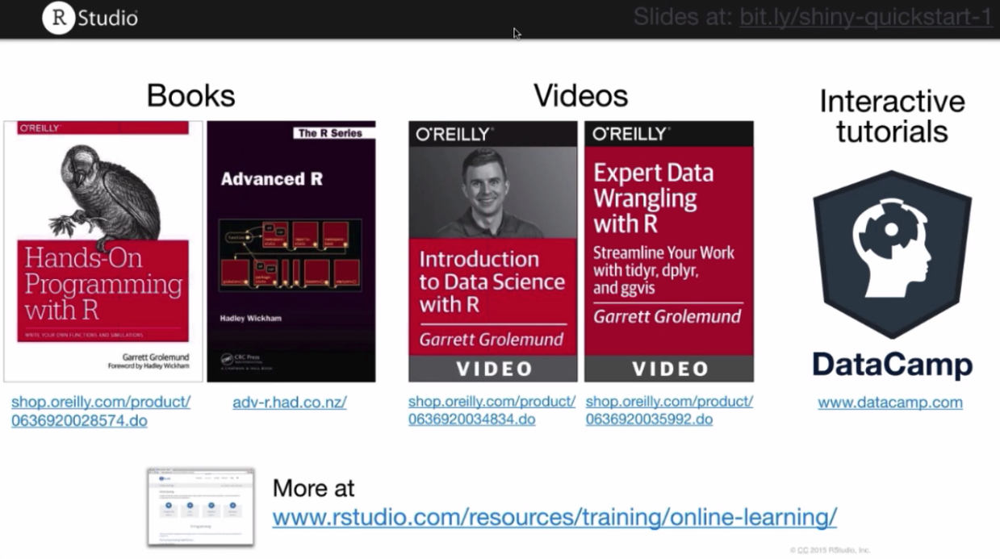

# Um pouco de motivação

Inicialmente, vimos os exemplos do pacote, que são aplicativos bem simples, ao menos, em relação ao visual. Para que não desanime, e possa ver as possibilidades de desing e personalização, acesse este link: [https://www.rstudio.com/products/shiny/shiny-user-showcase/](https://www.rstudio.com/products/shiny/shiny-user-showcase/).

No link você terá acesso à diversos aplicatos Shiny, nas aplicações mais diversas e com visuais excelentes. Dois exemplos interesantes são:
1. [https://gallery.shinyapps.io/genome_browser/](https://gallery.shinyapps.io/genome_browser/) uma aplicação bem técnica para visualização de genomas.
2. [https://mbienz.shinyapps.io/tourism_dashboard_prod/](https://mbienz.shinyapps.io/tourism_dashboard_prod/) um site completo feito em Shiny, pelo Ministério Público de Negócios, Inovação e Emprego da Nova Zelândia.
3. [https://gallery.shinyapps.io/3D_Mapping/](https://gallery.shinyapps.io/3D_Mapping/) um aplicativo para visualização de redes (grafos)

Como pode ver, o Shiny tem uma flexibilidade muito grande e aplicável à diversos campos..

Um pré-requisito para iniciar o desenvolvimento com Shiny é saber/entender de programação em R. A principal ideia do desenvolvimento de aplicativos é que seu usuário final não precise entender nada de programação, nada de Shiny, sequer precisa saber que o software foi feito em R. Ou seja, o desenvolvimento da interface depende muito da sua capacidade de entender sobre *Interação Humano Computador*, e a lógica que irá gerenciar seu app dependerá muito de seu conhecimento em R.

Não é o objetivo deste tutorial aprofundar nos conceitos de *Interação Humano Computador*, ou aspectos de desenvolvimento de software. Mas seguem algumas indicações de excelentes materiais para seus futuros estudos:

Vamos começar com as lições :D